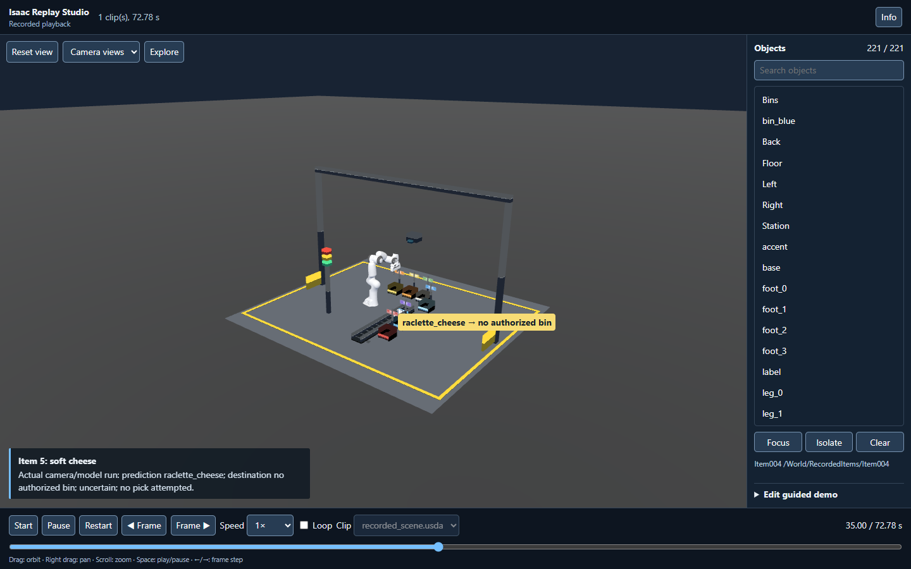

# Isaac Web Exporter

**Turn an Isaac Sim run into a scene people can explore, not just a video they
can watch.** Isaac Web Exporter packages compatible scene geometry, materials,
and recorded robot and object motion with a self-hostable browser player. The
recipient can open it on an ordinary WebGL-capable computer without installing
Isaac Sim, running Docker, or connecting to an RTX server.

[Explore the live cheese-factory export](https://adiy.ch/cheese) ·
[Download its sample package](sample-exports/cheese-factory/package.zip)



## Why browser export matters

Isaac Sim helps teams build and test complex robot systems, but the result is
harder to share than the simulation itself. A video captures one camera angle
at one pace. When a reviewer asks what happened outside that frame, the video
has no answer. An exported scene lets each viewer pause, scrub, step
frame by frame, orbit the camera, focus an object, and inspect the recorded
motion in the context of the surrounding environment. The same run can be
revisited without asking an engineer to rerun Isaac or operate a screen share.

For developers, this makes a project easier to review across disciplines.
They can share a captured workflow with teammates who do not have the source
stage, Isaac installation, or simulation hardware. A colleague can examine
the timing of a pick, the path of a robot link, or the position of an item
from a different viewpoint, then point to the same moment in the recording.
The package carries scene and object metadata alongside the animation, so the
viewer can identify what it is looking at rather than rely on a fixed camera
shot and narration.

For managers and other reviewers, the browser becomes a direct window into
the **recorded operation**. A guided tour can explain the task and jump to key
events, while the free camera and timeline let them check what the captured
robots and items did throughout the exported scene. They can see the sequence
and spatial relationships for themselves, including moments that a short
highlight video might skip. This is especially useful when a decision depends
on understanding the whole workflow rather than a single success frame.

For product and marketing teams, the same export can become an interactive
demo on a normal website. Visitors can start the workflow, pause at a feature,
explore the cell, and follow a curated explanation at their own pace. Static
hosting makes the demo easy to distribute without keeping a live simulator or
GPU server available for every visitor. A video still has a place when final
render quality or sensor imagery is the goal; the browser package adds agency,
object-level inspection, and repeatable access to the recorded 3D scene.

This is a valuable delivery step for Isaac Sim projects: the work done inside
the simulator becomes something developers, decision-makers, and prospective
users can inspect directly. The export is **recorded playback**, not live
physics or remote control. It shows the geometry and transform motion selected
for capture; project controllers, sensors, ROS, and unsupported animation are
not executed in the browser.

The bundled Three.js player provides Start/Pause/Restart, scrubbing, frame
stepping, speed and loop controls, camera navigation, object inspection, and a
guided-demo editor. An LLM is not required to view or customize a package.

The source repository is public but has no selected source-code license; see
[LICENSE_STATUS.md](LICENSE_STATUS.md). The authorized full-visual
[cheese-factory sample](sample-exports/cheese-factory/README.md) is included in
Git; other private project runs stay in ignored local `runs/` folders.
The v1 checklist and test evidence live in [V1_ACCEPTANCE.md](V1_ACCEPTANCE.md).

## Build and install

The tested exporter runs in Isaac Sim 6.1 (image digest and tool versions are
in [toolchain.lock.json](toolchain.lock.json)). Build tools require Python 3.12+
and Node/npm; recipients of a built package need neither Node nor Isaac.

```bash
python tools/build_release.py
```

The command stages a clean source copy, runs `npm ci` using
`web/player/package-lock.json`, builds Vite with relative URLs, and creates a
wheel under `dist/`. It checks for exactly one generated JavaScript and CSS
asset. The wheel includes the player, schemas, notices, and customization kit.
For editing the player locally, `python tools/build_player.py` also refreshes
the checked-in bundled template. Install the wheel into a compatible Isaac
Python environment; the exporter user does **not** need to build JavaScript:

```bash
/isaac-sim/python.sh -m pip install --no-deps /path/to/isaac_web_exporter-1.0.0-py3-none-any.whl
```

The remote Docker image in the lockfile is a reproducible development option,
not a runtime requirement for browser recipients. Do not install a separate
OpenUSD Python distribution into Isaac's environment.

## Export an owned example

Copy `tests/v1_sort_cell_guided.json` and change `bootstrap`, `experience` and
`output_dir` to paths visible inside your Isaac environment. The example
bootstrap `examples/sort_cell_workflow.py` authors a 30-second sorting scene;
its motion is scripted USD transform animation, not live physics. Its own
`fixture_common.py` must be alongside it. Use a **new** output directory—the
exporter refuses overwrite.

```bash
PYTHONPATH=/path/to/repo/src /isaac-sim/python.sh -m isaac_web_exporter.export \
  --config /path/to/repo/tests/v1_sort_cell_guided.json
python src/isaac_web_exporter/validate_package.py /path/to/output/package
python -m http.server 8000 --directory /path/to/output/package
```

Open `http://127.0.0.1:8000/`. You may instead install the wheel and use
`isaac-web-package-check /path/to/output/package`. The output also contains
`package.zip`, the disposable conversion stage, an unoptimized GLB when using
`quality_preset: compact`, a progress file, and an exporter report. Only
`package/` or its ZIP is needed by a recipient. Serve with HTTP, including
from a nested URL; direct `file://` loading is unsupported.

Three source forms share the core exporter:

- `bootstrap`: a Python module with `build(stage, app, config)`. It may return
  `{"on_step": callback}` to drive physics/controller updates. Capture is
  scoped to `capture_roots` and configured by duration, simulation rate,
  sample interval and FPS.
- `input_usd`: a saved USD with authored animation. Use `capture_roots: []`;
  the exporter preserves authored time samples rather than running physics.
- Already-loaded stage: call `run(config_path, app=app, stage=stage,
  on_step=callback)` from Isaac. The caller retains app/stage ownership. See
  `tools/loaded_stage_v1.py`.

The full cheese-factory model run uses a separate, project-specific adapter in
`tools/factory_capture_entry.py`. It runs the project's camera/model workflow
under Isaac's headless Kit entrypoint, records robot and active-object poses,
and authors one fixed-topology visual per item before handing the saved USD to
the reusable `input_usd` exporter. `tools/factory_capture_experience.py` builds
guided chapters from the actual run results. This adapter assumes the factory
project is mounted read-only at `/project`, this repository at `/work`, and the
factory's model service is available. It is an example of runtime integration,
not an automatic recorder for arbitrary Isaac applications. The
[cheese-factory sample export](sample-exports/cheese-factory/README.md) includes
the full visual browser package from the recorded 11-item camera/model run,
with its matching screenshots and validation evidence.

Set `mode: static` for an unanimated scene. `quality_preset: compact` is an
opt-in, bounded simplification of linear transform keys. The standard preset
keeps all converter output keys. `camera` and `camera_bookmarks` use Y-up
viewer-space coordinates.

The Isaac extension in `extensions/isaac.web.exporter/` opens an **Isaac Replay
Exporter** panel with source, selected roots, duration, sample rate, quality,
output, static mode, preflight, presets and local preview. Add
this extension folder to Isaac's extension search path and enable it. The panel
starts an isolated child Isaac export. There is no in-panel Cancel button in
v1; let an export finish before starting another. Progress may update slowly
when the workstation is heavily loaded. On the shared eight-core RTX test host,
the interactive panel passed its post-export button check with
`SimulationApp({"headless": False, "renderer": "MinimalRendering",
"limit_cpu_threads": 2})`; an unrestricted second Kit instance stalled
while the existing Isaac service consumed the remaining CPU. If you launch a
second Isaac Python process on a similarly loaded host, limit its Kit worker
threads or use a less busy host. The browser preview binds to `127.0.0.1` only.

## Package contract and customization

`scene.glb` is authoritative for geometry and recorded animation;
`manifest.json`, `scene-map.json`, `compatibility-report.json` and
`experience.json` are versioned metadata. The package ships readable schemas
and `LLM-HANDOFF.md`, plus three optional customization examples under
`customization/`. The default player works without an LLM. The public
`window.isaacReplay` API is documented in the package's customization guide.
Download an edited `experience.json` from the browser editor and replace that
file in the package to share a guided tour without re-exporting the GLB.

The v1 loader accepts unchanged `alpha-0.1` v0 packages for basic playback.
Their catalog covers only v0 captured objects and they have no packaged tour
metadata. Unknown schema versions fail. The offline validator checks relative
HTML resources, GLB integrity/hash, identities, sample times, schemas and
presentation references. Run it after customizing a package.

## Supported scope and troubleshooting

Supported motion is fixed-topology rigid/link transforms and authored USD
transform animation with static material bindings. Non-transform animated
properties, spawn/despawn, deformables, particles, animated material binding,
and arbitrary RTX/MDL appearance are outside v1. Missing visual dependencies,
required moving objects omitted by conversion, absent meshes/animation in
recorded mode, external GLB URLs and invalid metadata fail export/validation.
The compatibility report records approximations. A large scene may render
slowly on integrated graphics; the performance result in the acceptance file
applies to the owned 30-second sorting scene, not every factory.

If the panel preflight fails, check that the source path exists inside the
Isaac environment, that the output path is new, and that the running app is
Isaac 6.1. If conversion fails, inspect `report.json` and check that required
textures and referenced USD layers resolve. If a browser shows **Load failed**,
run the package validator, use HTTP rather than `file://`, check the browser
console, and verify all files from the ZIP were copied. A package with a
different schema version requires an explicit migration.

See [ROUTE_DECISION.md](ROUTE_DECISION.md) for why v1 uses GLB/Three.js rather
than USDZ/Web View, [V0_ACCEPTANCE.md](V0_ACCEPTANCE.md) for the earlier v0,
and [V1_IMPLEMENTATION_PLAN.md](V1_IMPLEMENTATION_PLAN.md) for all v1 gates.
